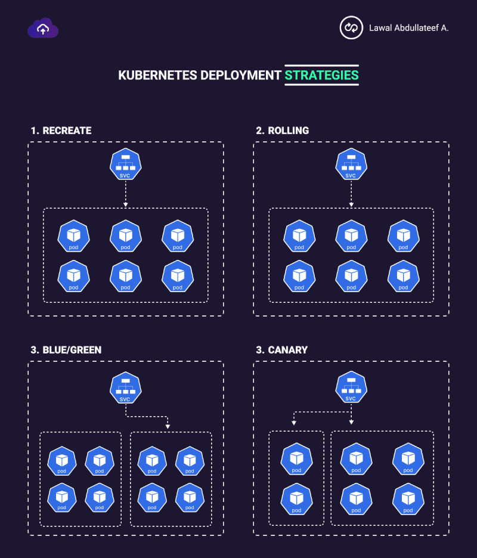

# Deployments

Deployment is a higher-level abstraction that manages the lifecycle of applications, ensuring they run correctly and efficiently. It provides a declarative way to define the desired state of your application, and the Deployment controller ensures that the current state matches the desired state.

## Deployment Solutions

### 1. Recreate

Recreate strategy involves shutting down all existing pods before creating new ones. This method ensures that the old version is entirely replaced by the new version.

**Downtime**: There may be a period of downtime during the transition.


---


### 2. Ramped

Ramped deployment strategy, often referred to as progressive delivery or staggered rollout, involves gradually updating a set of pods over a period of time. This strategy strikes a balance between speed and safety, allowing for monitoring and validation at each step before proceeding to the next batch.

**Key Features**:
- **Incremental Rollout**: Updates a few pods at a time rather than all at once.
- **Monitoring**: Provides the ability to monitor the new version's performance and rollback if issues arise.
- **Control**: Offers more control over the deployment process compared to rolling updates.

**Best Practices**:
- **Automated Monitoring**: Implement automated monitoring and alerting to detect any issues early during the deployment.
- **Health Checks**: Ensure health checks are in place so that Kubernetes can automatically handle unhealthy pods.
- **Rollback Plan**: Have a rollback plan ready in case the new version causes significant issues.
- **Gradual Increase**: Start with a very small batch size and gradually increase if the new version is performing well.
- **Canary Testing**: Combine ramped deployments with canary testing to initially expose a small, controlled subset of users to the new version.


```
strategy:
  type: RollingUpdate
  rollingUpdate:
    maxUnavailable: 2  # Controls how many Pods can be unavailable during the update process
    maxSurge: 2    # Controls how many Pods can be created above the desired number of Pods
```


```
    maxUnavailable: 2: This setting ensures that no more than 2 pods can be unavailable during the update process, which helps in maintaining application availability.
    maxSurge: 2: This allows Kubernetes to create up to 2 additional pods beyond the desired replica count to facilitate the update process.
```

---

3. Blue/Green

Blue-green deployment involves running two identical environments (blue and green). The current version runs in the blue environment, while the new version is deployed in the green environment. Traffic is switched to the green environment once the new version is verified.

Key Features:

- Zero downtime: Traffic is seamlessly switched to the new environment.
- Quick rollback: Can quickly switch back to the old environment if needed.

Implementation Steps:

- Deploy the new version to the green environment.
- Test the new version.
- Switch traffic from the blue environment to the green environment.
- Optionally, keep the blue environment as a backup.

---


4. Canary Deployment

Canary deployment involves rolling out the new version to a small subset of users before gradually rolling it out to the entire infrastructure. This approach allows for testing in production with minimal risk.

Key Features:

- Incremental rollout: New version is tested on a small subset of users.
- Risk mitigation: Reduces risk by limiting exposure to potential issues.

Implementation Steps:

- Deploy the new version alongside the old version.
- Route a small percentage of traffic to the new version.
- Monitor performance and issues.
- Gradually increase traffic to the new version until it fully replaces the old version.


---


5. A/B Testing

A/B testing is similar to canary deployment but focuses on comparing two versions of the application to determine which performs better. Different versions are deployed to different user segments, and performance metrics are analyzed to choose the better version.

Key Features:

- User experience testing: Compares two versions based on user feedback and performance.
- Data-driven decisions: Helps in making informed decisions based on real user data.


---
### Here is a Illustration




---
