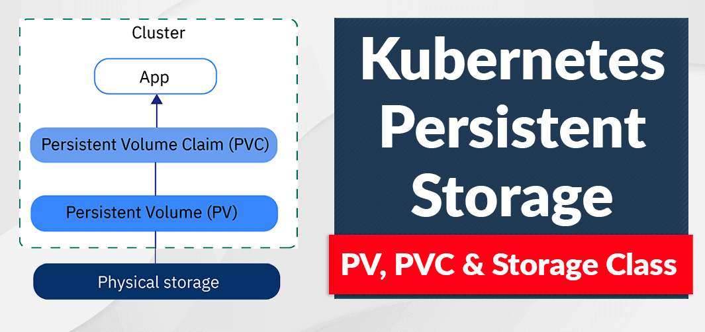
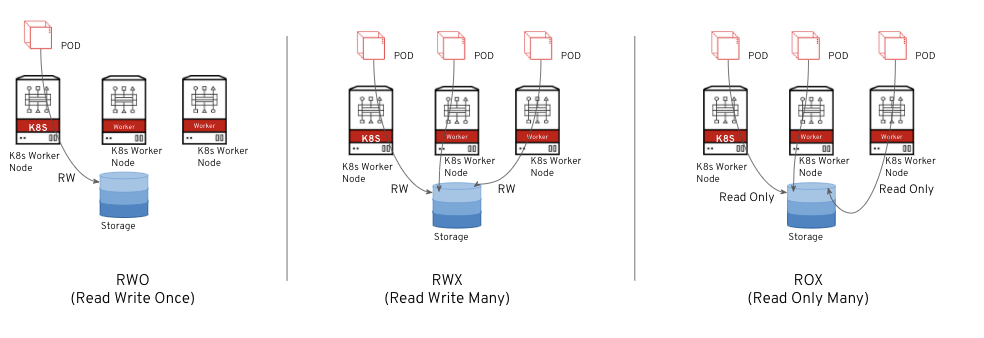

# Volumes

Kubernetes (K8s) volumes are a mechanism for storing and managing data that containers can access and share within a Kubernetes cluster. They provide a way to abstract and manage persistent storage for applications running in containers. 

## Key Concepts

### Ephemeral Volumes

Some applications need additional storage but don't care whether that data is stored persistently across restarts. For example, caching services are often limited by memory size and can move infrequently used data into storage that is slower than memory with little impact on overall performance

Other applications expect some read-only input data to be present in files, like configuration data or secret keys.

Ephemeral volumes are designed for these use cases. Because volumes follow the Pod's lifetime and get created and deleted along with the Pod, Pods can be stopped and restarted without being limited to where some persistent volume is available.

---


### Persistent volumes

A PersistentVolume (PV) is a piece of storage in the cluster that has been provisioned by an administrator or dynamically provisioned using Storage Classes. It is a resource in the cluster just like a node is a cluster resource. PVs are volume plugins like Volumes, but have a lifecycle independent of any individual Pod that uses the PV. This API object captures the details of the implementation of the storage, be that NFS, iSCSI, or a cloud-provider-specific storage system.

---

#### PersistentVolumeClaim 

A PersistentVolumeClaim (PVC) is a request for storage by a user. It is similar to a Pod. Pods consume node resources and PVCs consume PV resources. Pods can request specific levels of resources (CPU and Memory). Claims can request specific size and access modes (e.g., they can be mounted ReadWriteOnce, ReadOnlyMany, ReadWriteMany, or ReadWriteOncePod, see AccessModes).

---

#### StorageClass 
A StorageClass provides a way for administrators to describe the classes of storage they offer. Different classes might map to quality-of-service levels, or to backup policies, or to arbitrary policies determined by the cluster administrators. Kubernetes itself is unopinionated about what classes represent.

The Kubernetes concept of a storage class is similar to “profiles” in some other storage system designs.

---
---
### Just like this


---

#### Static provisioning

refers to the manual allocation and configuration of storage volumes before they are needed by pods. Static provisioning requires administrators to pre-allocate and manage storage resources in advance so that the data remains persistent after the containers stop running.


- as you would know this is not good way of handling storage allocating thats why we use StorageClass

---

### Storage access modes
Kubernetes let your application pod request for a volume with three different types of storage access modes: 


- Read Write Once (RWO) - This mode allows a storage volume to be accessed by a single pod with read-write access. This is useful for applications requiring block storage with low latency, for example, database applications.

- Read Write Many (RWX) - Applications that need to share the storage volume require RWX access mode. RWX lets developers attach a volume with multiple container pods in parallel to be able to share and access data on that volume. It also helps pods to autoscale inline with user demand while still sharing the same data source. Traditional file-based workloads and Multi-instance applications are a good example of this.

- Read Write Once (ROX) - This mode allows many nodes to access the storage volume in read-only mode. This is useful where you want to pre-populate a volume with static data and publish it to multiple application instances.




---
### Labels and Selectors

Labels are key/value pairs that are attached to objects such as Pods. Labels are intended to be used to specify identifying attributes of objects that are meaningful and relevant to users, but do not directly imply semantics to the core system. Labels can be used to organize and to select subsets of objects. Labels can be attached to objects at creation time and subsequently added and modified at any time. Each object can have a set of key/value labels defined. Each Key must be unique for a given object.

```
"metadata": {
  "labels": {
    "key1" : "value1",
    "key2" : "value2"
  }
}

```

#### Motivation

Labels enable users to map their own organizational structures onto system objects in a loosely coupled fashion, without requiring clients to store these mappings.


---


#### Taints and Tolerations

Node affinity is a property of Pods that attracts them to a set of nodes (either as a preference or a hard requirement). Taints are the opposite -- they allow a node to repel a set of pods.

Tolerations are applied to pods. Tolerations allow the scheduler to schedule pods with matching taints. Tolerations allow scheduling but don't guarantee scheduling: the scheduler also evaluates other parameters as part of its function.

Taints and tolerations work together to ensure that pods are not scheduled onto inappropriate nodes. One or more taints are applied to a node; this marks that the node should not accept any pods that do not tolerate the taints


---

#### Node Affinity in Kubernetes
Last Updated : 06 May, 2024
Node affinity in Kubernetes refers to the ability to assign a Kubernetes pod to a specific node or group of nodes in a cluster based on specific criteria. A feature called node affinity is employed to guarantee that particular pods are located on particular nodes in a cluster. This facilitates better resource management and performance optimization of the application.

---


